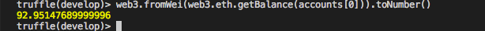

# Développez votre premier Smart Contract Ethereum  (DRAFT)

Dans ce guide, je vous propose de découvrir la programmation de *Smart Contract Ethereum*.
*Ethereum*, en plus de permettre le transfert d'argent via des Ethers,  est aussi adapté au développement d'applications décentralisées ou *DApps*.

Développer des applications décentralisées *DApps* revient à développer des *Smart Contracts* ou «contrats intelligents».

Il existe aujourd'hui un écosystème de développement de *Dapps* avec des langages de programmation variés, dont le plus populaire est  [Solidity](https://solidity.readthedocs.io/en/develop/) (celui que nous utiliserons dans ce guide).

Nous allons utiliser le framework [Truffle](http://truffleframework.com/) qui fournit un certain nombre de composants nécessaires au développement de *Smart Contract*.

Nous utiliserons l'IDE [Visual Studio](https://www.visualstudio.com/fr/) avec l'extension Solidity (pour la coloration syntaxique et l'auto-complétion.

Vous aurez également besoin de Docker sur votre machine, tous les composants (nodejs, Truffle) nécessaires au développement de votre *Smart Contract* étant packagés dans un container docker que vous trouvez sur dockerHub : [grydl/truffle](https://hub.docker.com/r/grydl/truffle/)

#### Maintenant, passons au concret !

* Téléchargez et installez Visual Studio : [https://www.visualstudio.com](https://www.visualstudio.com/), Notez que vous pouvez aussi utiliser un autre éditeur (IDE) ou un simple éditeur de texte.

* Téléchargez et installez également Docker sur votre machine : [https://docs.docker.com/engine/installation/](https://docs.docker.com/engine/installation/)

Nous allons construire un *Smart Contract* simple (**FirstContract**), dont la logique est :

1. Recevoir des Ethers à l'adresse du *Smart Contract*
2. Stocker dans une variable la valeur d'Ethers reçue (méthode **setEther**)
3. Retrouver la valeur stockée dans la variable (méthode **getEther**)
4. Retrouver la valeur totale d'Ethers reçue dans le *Smart Contract* (méthode **getTotal**)

* Créez votre répertoire de travail, nommez ce répertoire **projet**. C'est le répertoire qui va contenir les fichiers de votre *Smart Contract*.

```bash
mkdir  projet
```

* Importez le répertoire projet dans l'Editeur Visual Studio [**Ouvrir un dossier**]


* Lancez la console intégrée dans Visual Studio [Afficher Terminal intégré]


Vous aurez ainsi accès au Framework de développement Truffle. Ce Framework est fourni dans un container Docker **grydl/truffle****.
*Vous n'avez donc pas à installer Truffle, nodejs, et npm sur votre ordinateur.*
N'oubliez pas de remplacer la partie **XXXXX** par le chemin absolu jusqu'à votre répertoire **projet**.

* Exécutez la commande ci-dessous pour démarrer le container Docker grydl/truffle .

```bash
docker run -v /xxxxx/xxxxxx/xxxxx/xxxxx/projet:/projet --name truffle --rm -i -t grydl/truffle  bash
```

**Attention ! Si votre container docker grydl/truffle est déjà démarré, utilisez la commande ci-dessous pour vous y connecter.**

```bash
docker exec -it truffle bash
```

* Si tout se passe bien, vous verrez une invite de commande de type :

```bash
root@c8f63734ebe9:/#
```

* Vérifiez que vous avez bien accès à **Truffle** avec la commande suivante :

```bash
root@c8f63734ebe9:/# truffle version
Truffle v4.0.5 (core: 4.0.5)
Solidity v0.4.18 (solc-js)
```

* Déplacez-vous dans le répertoire **project**.

```bash
root@00c19832604b:/# cd projet/
root@00c19832604b:/projet#
```

* Initialisez le projet du _Smart Contract_. Cette commande ci-dessous va créer la structure de votre projet.

```bash
root@00c19832604b:/projet# truffle init
Downloading...
Unpacking...
Setting up...
Unbox successful. Sweet!

Commands:
  Compile:        truffle compile
  Migrate:        truffle migrate
  Test contracts: truffle test
```

* **contracts :** répertoire contenant les fichiers de votre _Smart Contract_ Solidity
* **migrations :** répertoire contenant votre script de deployment
* **test :** répertoire contenant vos fichiers de test (unitaires ou intégrations) solidity or javascript
* **truffle-config.js et truffle.js :** fichiers de configuration


Nous allons créer dans le répertoire **«contracts** le fichier *FirstContract.sol* (*Smart Contract*) ayant 4 méthodes permettant de :

1. Recevoir les Ethers
2. Stocker la valeur
3. Retrouver la dernière valeur reçue
4. Retrouver la valeur totale d&#39;Ethers dans le Smart Contract

* Écrivez le code ci-dessous dans le fichier **FirstContract.sol**

```javascript
pragma solidity ^0.4.0;

  /**
   * Mon premier Smart Contract
   * @dev Charles Azanlekor <contact@grydl.com>
   * 2018.01.20
   * V 1.0
   */
contract FirstContract {

   //Variable qui stocke la valeur de l'Ether reçue
   uint public solde;

  /**
   * @dev Fallback function qui permet de recevoir les Ethers
   * <msg.value> permet de retrouver la valeur d'Ether reçue 
   * C'est cette fonction qui est appelée lorsque l'utilisateur envoie des Ethers aux
   * Smart Contract sans appeler aucune fonction
   */
   function () public payable {
    setEther(msg.value);
   }

  /**
   * Méthode permattant d'affecter une valeur à la variable <solde> 
   * Nous pouvons ainsi affecter la valeur de l'Ether reçue à la variable <solde>
   */
   function setEther (uint valeur) public payable {
       solde = valeur;
   }

   /**
    * Méthode permettant de retrouver la valeur de la variable <solde>
    * Nous pouvons ainsi retrouver la valeur stockée dans la variable <solde>
    */
   function getEther() public constant returns (uint) {
       return solde;       
   }

   /**
    * Méthode permettant de retrouver la balance ou le solde d'Ether du Smart Contract
    */
   function getTotal() public constant returns (uint) {
       return this.balance;
   }
    
}
```

* Créez ensuite dans le répertoire  **migrations** le fichier   **2_deploy_contracts.js**

Ce fichier permet de déployer le *Smart Contract* **FirstContract.sol** que nous venons de créer.

Notez que le fichier est préfixé par le nombre 2 (c'est-à-dire qu'il ne faudra pas oublier de préfixer le prochain fichier de déploiement par le nombre 3).

* Copiez le contenu ci-dessous dans le fichier **2_deploy_contracts.js**

```javascript
varFirstContract = artifacts.require("FirstContract");

module.exports = function(deployer) {
 deployer.deploy(FirstContract);
};
```

* Compilez ensuite le projet.

```bash
root@f64cdc2b42ac:/projet# truffle compile
Compiling ./contracts/FirstContract.sol...
Compiling ./contracts/Migrations.sol...
Writing artifacts to ./build/contracts
```

Si tout se passe bien, vous ne devriez pas avoir d'erreur ou ni de warning.


* Démarrez la Blockchain Ethereum de test fournie avec truffle.

```bash
root@f64cdc2b42ac:/projet# truffle develop

Truffle Develop started at http://localhost:9545/
Accounts:
(0) 0x627306090abab3a6e1400e9345bc60c78a8bef57
(1) 0xf17f52151ebef6c7334fad080c5704d77216b732
(2) 0xc5fdf4076b8f3a5357c5e395ab970b5b54098fef
(3) 0x821aea9a577a9b44299b9c15c88cf3087f3b5544
(4) 0x0d1d4e623d10f9fba5db95830f7d3839406c6af2
(5) 0x2932b7a2355d6fecc4b5c0b6bd44cc31df247a2e
(6) 0x2191ef87e392377ec08e7c08eb105ef5448eced5
(7) 0x0f4f2ac550a1b4e2280d04c21cea7ebd822934b5
(8) 0x6330a553fc93768f612722bb8c2ec78ac90b3bbc
(9) 0x5aeda56215b167893e80b4fe645ba6d5bab767de

Private Keys:
(0) c87509a1c067bbde78beb793e6fa76530b6382a4c0241e5e4a9ec0a0f44dc0d3
(1) ae6ae8e5ccbfb04590405997ee2d52d2b330726137b875053c36d94e974d162f
(2) 0dbbe8e4ae425a6d2687f1a7e3ba17bc98c673636790f1b8ad91193c05875ef1
(3) c88b703fb08cbea894b6aeff5a544fb92e78a18e19814cd85da83b71f772aa6c
(4) 388c684f0ba1ef5017716adb5d21a053ea8e90277d0868337519f97bede61418
(5) 659cbb0e2411a44db63778987b1e22153c086a95eb6b18bdf89de078917abc63
(6) 82d052c865f5763aad42add438569276c00d3d88a2d062d36b2bae914d58b8c8
(7) aa3680d5d48a8283413f7a108367c7299ca73f553735860a87b08f39395618b7
(8) 0f62d96d6675f32685bbdb8ac13cda7c23436f63efbb9d07700d8669ff12b7c4
(9) 8d5366123cb560bb606379f90a0bfd4769eecc0557f1b362dcae9012b548b1e5

Mnemonic: candy maple cake sugar pudding cream honey rich smooth crumble sweet treat

truffle(develop)>
```

* Vous serez dans l'environnement de développement de Truffle et la console affichera désormais :

```bash
truffle(develop)>
```

* Vous pouvez maintenant déployer votre *Smart Contract* sur la Blockchain de test directement à partir de l'environnement de développement de Truffle grâce à la commande : **migrate**

```bash
truffle(develop)> migrate

Using network 'develop'.

Running migration: 1_initial_migration.js

  Deploying Migrations...
  ... 0xcfd53e5ee5219a018e925dfd349aabdae71c639826fbcd0616cea9b5bb2d545d
  Migrations: 0x8cdaf0cd259887258bc13a92c0a6da92698644c0
Saving successful migration to network...
  ... 0xd7bc86d31bee32fa3988f1c1eabce403a1b5d570340a3a9cdba53a472ee8c956
Saving artifacts...
Running migration: 2_deploy_contracts.js
  Deploying FirstContract...
  ... 0xa8907291a6cd160dd459a0447e0f0bac628bea9f7f706605575a5f4f253918d4
  FirstContract: **0x345ca3e014aaf5dca488057592ee47305d9b3e10**
Saving successful migration to network...
  ... 0xf36163615f41ef7ed8f4a8f192149a0bf633fe1a2398ce001bf44c43dc7bdda0
Saving artifacts...
```

Vous pouvez ainsi voir que le *Smart Contract* **FirstContract** a été deployé sur la Blockchain de test avec l'adresse : **0x345ca3e014aaf5dca488057592ee47305d9b3e10**

#### Nous allons maintenant interagir avec le *Smart Contract*.

* Consultez la **balance** du *Smart Contract*. (On obtient 0 Ether.)

```bash
truffle(develop)> web3.fromWei(web3.eth.getBalance(FirstContract.address)).toNumber()
0
```


* Affectez à la variable **accounts** la liste de tous les comptes Ethereum de la Blockchain test.

```bash
truffle(develop)> web3.eth.getAccounts(function(err,res) { accounts = res; });
undefined
truffle(develop)> accounts

[ '0x627306090abab3a6e1400e9345bc60c78a8bef57',
  '0xf17f52151ebef6c7334fad080c5704d77216b732',
  '0xc5fdf4076b8f3a5357c5e395ab970b5b54098fef',
  '0x821aea9a577a9b44299b9c15c88cf3087f3b5544',
  '0x0d1d4e623d10f9fba5db95830f7d3839406c6af2',
  '0x2932b7a2355d6fecc4b5c0b6bd44cc31df247a2e',
  '0x2191ef87e392377ec08e7c08eb105ef5448eced5',
  '0x0f4f2ac550a1b4e2280d04c21cea7ebd822934b5',
  '0x6330a553fc93768f612722bb8c2ec78ac90b3bbc',
  '0x5aeda56215b167893e80b4fe645ba6d5bab767de']
```

* Consultez la *balance* du premier compte **accounts[0]** : **0x627306090abab3a6e1400e9345bc60c78a8bef57**

```bash
truffle(develop)> web3.fromWei(web3.eth.getBalance(accounts[0])).toNumber()
99.9514769
```


* Envoyez 7 Ethers au *Smart Contract* à partir du compte **accounts[0]**.

```javascript
truffle(develop)> web3.eth.sendTransaction({ from:accounts[0], to: FirstContract.address, value: web3.toWei("7.0","ether")})
'0xf54822094609330bf9fc618f93c5169e897ba03f042b55cd4e1324ea4cea47a0'
```

* Consultez ensuite la *balance* du compte **accounts[0]** pour voir si le solde restant est bien 92.95 Ethers (99.95 – 7).

```javascript
web3.fromWei(web3.eth.getBalance(accounts[0])).toNumber()
```



* Consultez le compte du *Smart Contract* pour voir si le solde est bien passé à 7 Ethers.

```javascript
web3.fromWei(web3.eth.getBalance(FirstContract.address)).toNumber()
```


* Consultez le solde du *Smart Contract* avec la méthode **getTotal** du *Smart Contract*.

```javascript
FirstContract.deployed().then(function(instance){return instance.getTotal.call();}).then(function(value){return web3.fromWei(value).toNumber()});
```


* Consultez la valeur stockée dans la variable dans le _Smart Contract_ (dernière somme envoyée au _Smart Contract_) avec la méthode getEther()

```javascript
FirstContract.deployed().then(function(instance){return instance.getEther.call();}).then(function(value){return web3.fromWei(value).toNumber()});
```


**Félicitations ! Vous venez de créer votre premier _Smart Contract_, et il semble fonctionner comme espéré.**

* Pour quitter l'environnement de développement de Truffle, utilisez les touches

#### CTRL + C (2 fois)

Notez qu'il est possible de débuguer votre *Smart Contract*, mais cela fera l'objet d'un autre article.

Pour ceux qui veulent allez plus loin :

* La documentation de Truffle : [http://truffleframework.com/docs/](http://truffleframework.com/docs/)
* La documentation d'Ethereum : [http://www.ethdocs.org/en/latest/](http://www.ethdocs.org/en/latest/)
* La documentation du langage Solidity : [Solidity](http://solidity.readthedocs.io/en/latest/)
* Le code source du projet   :  [FirstContrcat](https://github.com/Grydl/FirstContrcat.git)

Merci, n'hésitez à partager et à m'écrire si jamais vous rencontrez des problèmes.

Grydl Analytics contact[at]grydl.com
